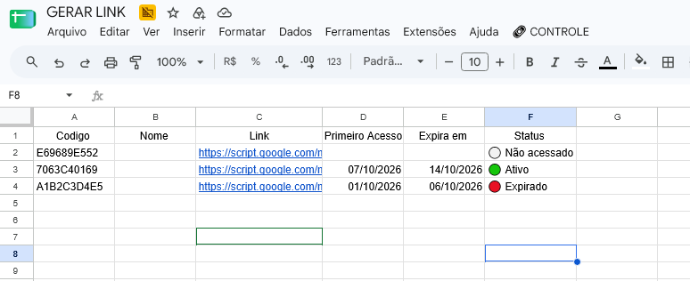

# 🔗 Controle de Links Temporários para Google Forms

Sistema desenvolvido em Google Apps Script para geração e controle de links temporários de acesso a um Google Forms.

## 💼 Contexto do projeto

Este projeto foi desenvolvido para atender a uma necessidade real do ambiente corporativo, criando uma solução para controlar o acesso temporário a formulários utilizados em um processo interno de desligamento de colaboradores.

A solução permite gerar links individuais, registrar o primeiro acesso e controlar automaticamente o prazo de validade de cada link.

## ⚙️ Funcionalidades

- Geração de links individuais
- Criação de códigos únicos
- Registro do primeiro acesso
- Prazo de validade configurável
- Controle de status dos links
- Expiração automática
- Bloqueio de acesso após a expiração
- Redirecionamento para Google Forms
- Geração de novos links quando necessário
- Controle através do Google Sheets

## 🛠️ Tecnologias utilizadas

- JavaScript
- Google Apps Script
- Google Sheets
- Google Forms

## 📊 Estrutura da planilha

| Código | Nome | Link | Primeiro acesso | Expira em | Status |
|--------|------|------|-----------------|-----------|--------|
| ABC123 | Colaborador | Link | Data/Hora | Data/Hora | 🟢 Ativo |

## 🔄 Funcionamento

1. Um novo link é gerado através do Google Sheets.
2. O sistema cria um código único.
3. O link começa com o status `Não acessado`.
4. No primeiro acesso, o sistema registra a data e hora.
5. O prazo de validade começa a contar a partir desse primeiro acesso.
6. Enquanto estiver dentro do prazo, o usuário é direcionado ao Google Forms.
7. Após o prazo, o link é marcado como `Expirado`.
8. Links expirados não permitem acesso ao formulário.
9. Um novo link pode ser gerado quando necessário.

## ⏱️ Prazo de validade

O projeto está configurado como exemplo para utilizar:

```text
7 dias
```

## 📸 Demonstração



*Exemplo da interface utilizada para controlar os links temporários.*
